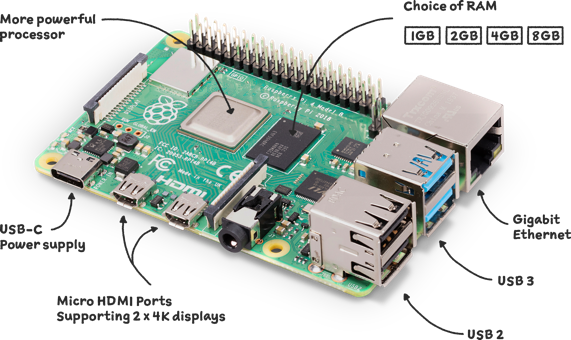
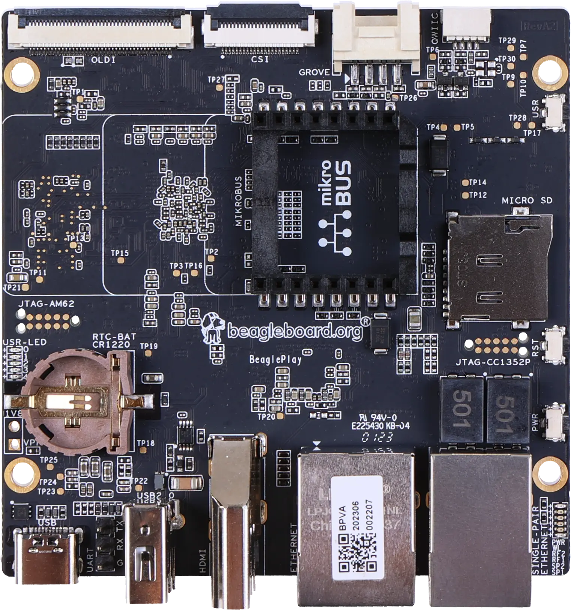

# HMI GUI with Dear ImGUI framework

Opensource Graphical User Interface in C++ using Dear ImGui Framework

Key features:

- [x] Modern C++20
- [x] CMake -> FetchContent (~ package management)
- [x] Native (x86_64) and Cross (arm64) compilation
- [x] App-Core architecture
- [x] Immediate-mode GUI (Dear IMGUI)
- [x] GLFW3 renderer graphics backend
- [x] OpenGL ES3.0
- [ ] Vulkan
- [ ] PostgreSQL database (PQXX)
- [ ] Modbus TCP/IP connection
- [ ] CAN-BUS connection (to be implemented)
- [ ] Custom Linux Preempt-RT patch
- [ ] zRAM enabled
- [ ] Remote access via OpenVPN (to be implemented)

## Targets

### Raspberry Pi4 (AARCH64)

- https://www.raspberrypi.com/products/raspberry-pi-4-model-b/

  

### BeagleBone Play (AARCH64)

- https://www.beagleboard.org/boards/beagleplay
- https://docs.beagleboard.org/latest/boards/beagleplay/

  

# [Dependencies](_docs/dependencies.md)

### [Package Management](https://decovar.dev/blog/2021/03/08/cmake-cpp-library/)

- CMake -> FetchContent (~package manager)
- https://cmake.org/cmake/help/latest/module/FetchContent.html

### Libraries

- OpenGL / OpenGL ES https://www.opengl.org/
- GLFW3
- STB_image
- Dear IMGUI
    - Project fork from source
    - https://github.com/ocornut/imgui.git
    - Add CMakeList.txt file to integrate with project
    - https://github.com/danielbrupaiva/imgui.git
- Spdlog v1.13.0
    - https://github.com/gabime/spdlog.git
- PostgreSQL 16.1
    - [postgresql.md](_docs/postgresql.md)
- PQXX Official C++ client API for PostgreSQL 7.8.1
    - https://www.postgresql.org/
    - https://pqxx.org/
    - https://libpqxx.readthedocs.io/en/stable/
- Catch2 v3.4.0
    - https://github.com/catchorg/Catch2.git
- FakeIt

# Build

Install dependencies [Dependencies](_docs/dependencies.md)

    $ git clone --recursive https://github.com/danielbrupaiva/imgui-hmi.git -b imgui-hmi 
    $ cd /path/to/src
    $ mkdir /path/to/build_folder

    [HOST]
    $ cmake -G Ninja -S /path/to/src -B /path/to/build_folder \
                    -DCMAKE_BUILD_TYPE=Release \
                    -DBUILD_FROM_SRC:BOOL=ON \
    $ ninja

    [Cross-Compile] 
    $ cmake -G Ninja -S /path/to/src -B /path/to/build_folder \
                    -DCMAKE_BUILD_TYPE=Release \
                    -DBUILD_FROM_SRC:BOOL=ON \
                    -DCROSS_COMPILER:BOOL=ON \
                    -DCMAKE_TOOLCHAIN_FILE=_cmake/rpi4.cmake                    
    $ ninja

# References

- https://en.cppreference.com/
- https://github.com/ocornut
- https://github.com/MikeShah
- https://github.com/TheCherno/Cherno
- https://www.youtube.com/@CppCon
- https://www.youtube.com/@LearnQtGuide
- https://www.youtube.com/@ulasdikme7307
- https://www.youtube.com/@DavesGarage
- https://www.youtube.com/@ZenSepiol
