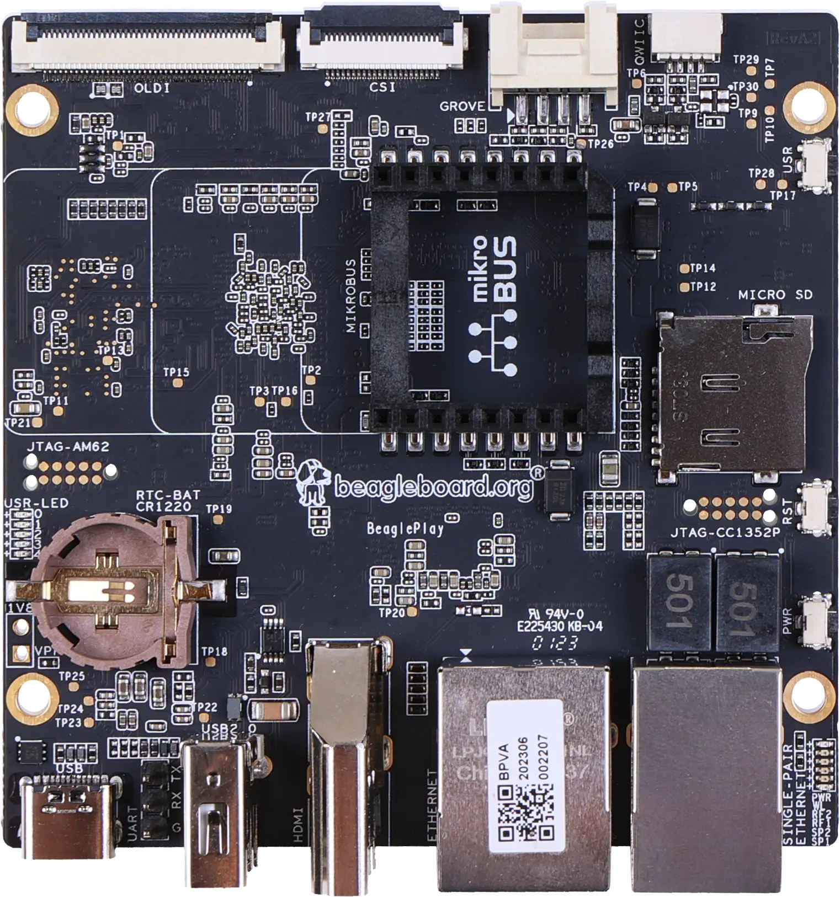

# HMI GUI with Dear ImGUI framework

Open source Graphical User Interface in C++ using Dear ImGui Framework

## Application Software Layer

- [x] App-Core-Data architecture
- [x] Modern C++20
- [x] CMake -> FetchContent (~ package management)
- [x] Dockerfile for Native (x86_64) and Cross compilation (aarch64)
- [x] Immediate-mode GUI (Dear IMGUI)
- [x] OpenGL ES3.0
- [x] GLFW3 renderer graphics backend
- [x] SQLite3
- [ ] Modbus TCP/IP connection
- [ ] CANbus connection

## System Software Layer

- [x] Embedded Linux OS
- [x] Preempt-RT patch
- [x] zRAM enabled
- [ ] Custom disto (Yocto or Buildroot) 
- [ ] https://github.com/danielbrupaiva/yocto-garden
- [ ] https://github.com/danielbrupaiva/buildroot

## Hardware Layer

<table width="100%">
  <tr>
    <td style="text-align:center;">
      <a href="https://www.raspberrypi.com/products/raspberry-pi-4-model-b/">Raspberry Pi 4 Model B</a><br>
      <a href="https://www.raspberrypi.com/documentation/computers/raspberry-pi.html">Documentation</a>
    </td>
    <td style="text-align:center;">
      <a href="https://www.beagleboard.org/boards/beagleplay">BeagleBone Play</a><br>
      <a href="https://docs.beagleboard.org/latest/boards/beagleplay/">Documentation</a>
    </td>
  </td>
  <tr>
    <td style="text-align:center;">      
      
    </td>
    <td style="text-align:center;">      
      
    </td>
  </tr>

</table>

## [Package Management](https://decovar.dev/blog/2021/03/08/cmake-cpp-library/)


- CMake -> FetchContent (~package manager)
- https://cmake.org/cmake/help/latest/module/FetchContent.html

## Libraries

### TDD - Test Driven Design 
- Catch2 v3.4.0
    - https://github.com/catchorg/Catch2.git
- FakeIt

# Build
 [Dependencies](docs/dependencies.md)

```bash
#Install dependencies
sudo apt update
sudo apt install -y --no-install-recommends ca-certificates \
    pkg-config build-essential ninja-build cmake make gcc autoconf libtool automake m4 gawk texinfo bison \
    file git wget curl rsync symlinks python3 xz-utils xutils-dev p7zip-full symlinks openssh-client net-tools iputils-ping
# Install Official AARCH64 toolchain
sudo apt install -y gcc-aarch64-linux-gnu g++-aarch64-linux-gnu
# Install project and QT dependencies
sudo apt install -y --no-install-recommends libsqlite3-dev libgl1-mesa-dev libegl1-mesa libegl1 libgl1-mesa-glx \
    libglx-mesa0 libgles2-mesa-dev libxkbcommon-dev libwayland-dev libxrandr-dev libxinerama-dev libxcursor-dev \
    libxi-dev tcl-dev libclang-dev clang gperf libfontconfig1-dev libfreetype6-dev libx11-dev libx11-xcb-dev libxext-dev \
    libxfixes-dev libxi-dev libxrender-dev libxcb1-dev libxcb-glx0-dev libxcb-keysyms1-dev libxcb-image0-dev libxcb-shm0-dev \
    libxcb-icccm4-dev libxcb-sync-dev libxcb-xfixes0-dev libxcb-shape0-dev libxcb-randr0-dev libxcb-render-util0-dev \
    libxcb-util-dev libxcb-xinerama0-dev libxcb-xkb-dev libxkbcommon-dev libxkbcommon-x11-dev libatspi2.0-dev libglu1-mesa-dev freeglut3-dev
```

```bash
git clone --recursive -b imgui-hmi https://github.com/danielbrupaiva/imgui-hmi.git
cd imgui-hmi
```

[Docker]
Install docker according Docker documentation at your system (prefered OS Linux, not tested at Windows)
```bash
docker compose up -d
docker exec -it imgui bash
```
Notes:
Source folder: /home/dev/workspace
Build folder: /home/dev/workspace/build/

[HOST]
Release
```bash
cmake -G Ninja -S /home/dev/workspace -B /home/dev/workspace/build/host \
            -DCMAKE_BUILD_TYPE=Release \
            -DBUILD_FROM_SRC:BOOL=ON 
ninja -C /home/dev/workspace/build/host
```

Debug
```bash
cmake -G Ninja -S /home/dev/workspace -B /home/dev/workspace/build/host-debug \
            -DCMAKE_BUILD_TYPE=Debug \
            -DBUILD_FROM_SRC:BOOL=ON 
ninja -C /home/dev/workspace/build/host-debug
```

For TDD/coverage
```bash
cmake -G Ninja -S /home/dev/workspace -B /home/dev/workspace/build/host-coverage \
            -DCMAKE_BUILD_TYPE=Debug \
            -DBUILD_FROM_SRC:BOOL=ON \
            -DCMAKE_C_FLAGS=--coverage 

ninja -C /home/dev/workspace/build/host-coverage

/home/dev/workspace/build/host-coverage/tests/tests
```

[Cross-Compile]     

```bash
cmake -G Ninja -S /home/dev/workspace/ -B /home/dev/workspace/build/target \
  -DCMAKE_BUILD_TYPE=Release \
  -DBUILD_FROM_SRC:BOOL=ON \
  -DTARGET_SYSROOT=/opt/sysroots/beagleplay \
  -DCMAKE_TOOLCHAIN_FILE=cmake/beagleplay.cmake               

ninja -C /home/dev/workspace/build/target 
```
# References

- https://en.cppreference.com/
- https://github.com/ocornut
- https://github.com/MikeShah
- https://github.com/TheCherno/Cherno
- https://www.youtube.com/@CppCon
- https://www.youtube.com/@LearnQtGuide
- https://www.youtube.com/@ulasdikme7307
- https://www.youtube.com/@DavesGarage
- https://www.youtube.com/@ZenSepiol

