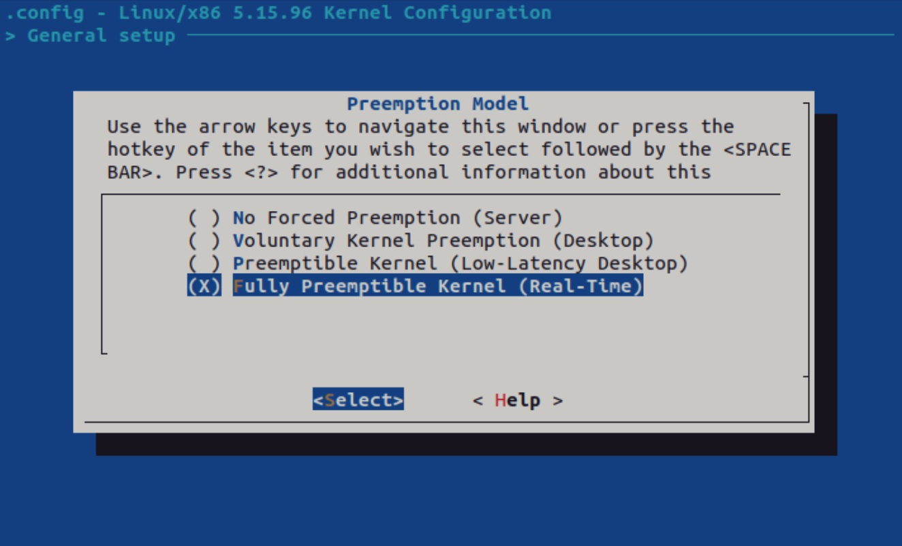

[BACK](../README.md)
# PREEMPT-RT
## Target

    $ uname -a

        Linux raspberrypi 6.6.31+rpt-rpi-v8 #1 SMP PREEMPT Debian 1:6.6.31-1+rpt1 (2024-05-29) aarch64 GNU/Linux
    
    $ uname -r

        6.6.31+rpt-rpi-v8

## Host

Download Linux kernel sources

    $ wget https://mirrors.edge.kernel.org/pub/linux/kernel/v6.x/linux-6.6.31.tar.xz

Download PREEMPT-RT patch equivalent to the Linux kernel

    $ wget https://cdn.kernel.org/pub/linux/kernel/projects/rt/6.6/older/patch-6.6.31-rt31.patch.xz

Untar

    $ tar -xzf linux-6.6.31.tar.xz
    $ xz -d patch-6.6.31-rt31.patch.xz

Applying the path    

    $ cd linux-6.6.31
    $ patch -p1 <../patch-6.6.31-rt31.patch
    $ scp pi@192.168.0.191:/boot/config-6.6.31+rpt-rpi-v8 .config

Menuconfig 

    $ make -j$(nproc) ARCH=arm64 CROSS_COMPILE=aarch64-linux-gnu- menuconfig

Build

    $ sudo make -j$(nproc) ARCH=arm64 CROSS_COMPILE=aarch64-linux-gnu- Image modules dtbs
    $ sudo make -j$(nproc) ARCH=arm64 CROSS_COMPILE=aarch64-linux-gnu- all

Install the kernel
    
    $ lsblk
        sdc                       8:32   1 119.1G  0 disk  
        ├─sdc1                    8:33   1   512M  0 part  /media/daniel/bootfs
        └─sdc2                    8:34   1 118.6G  0 part  /media/daniel/rootfs

    $ mkdir mnt 
    $ mkdir mnt/boot 
    $ mkdir mnt/root
    
    $ sudo mount /dev/sdc1 ./mnt/boot/
    $ sudo mount /dev/sdc2 ./mnt/root/

    $ cd path/to/linux_src
    $ sudo make -j$(nproc) ARCH=arm64 CROSS_COMPILE=aarch64-linux-gnu- INSTALL_MOD_PATH=path/to/mnt/root modules_install
    
    $ ls path/to/mnt/boot/*.img
        -rw-r--r-- 1 daniel daniel 8.9M Jun 16 11:58 path/to/mnt/boot/kernel_2712.img
        -rw-r--r-- 1 daniel daniel 8.9M Jun 16 11:58 path/to/mnt/boot/kernel8.img

    $ echo $KERNEL
    $ sudo cp path/to/mnt/boot/$KERNEL.img path/to/mnt/boot/$KERNEL_backup.img
    $ sudo cp path/to/linux_src/arch/arm64/boot/Image path/to/mnt/boot/$KERNEL.img
    $ sudo cp path/to/linux_src/arch/arm64/boot/dts/broadcom/*.dtb path/to/mnt/boot/
    $ sudo cp path/to/linux_src/arch/arm64/boot/dts/overlays/*.dtb* path/to/mnt/boot/overlays/
    $ sudo cp path/to/linux_src/arch/arm64/boot/dts/overlays/README path/to/mnt/boot/overlays/
    $ sudo umount mnt/boot
    $ sudo umount mnt/root

Boot device and verify PREEMPT_RT patch

    $ uname -a
        Linux raspberrypi 6.6.31-rt31-v8 #4 SMP PREEMPT_RT Sun Jun 16 16:09:49 -03 2024 aarch64 GNU/Linux

## References

- https://docs.beagleboard.org/latest/boards/beagleplay/demos-and-tutorials/play-kernel-development.html
- https://phoenixnap.com/kb/build-linux-kernel
- https://www.acontis.com/ja/building-a-real-time-linux-kernel-in-ubuntu-with-preempt-rt.html
- https://www.raspberrypi.com/documentation/computers/linux_kernel.html
- https://gts3.org/2017/cross-kernel.html